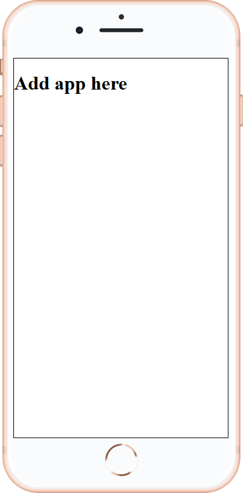

# Phone Template

### Description
**The Phone Template** is an a template that allows html to be rendered inside of a phone-like body, in this case, an iPhone 8

### Prerequisites 
[Git](https://git-scm.com/) - version control software

### Getting Starting

##### Step 1 - Install Git
*Windows* - Download/Install git from https://git-scm.com/download/win

*Linux* - `apt install git` [deb-based], `dnf install git` [rpm-based]

##### Step 2 - Clone Package using Git
*Run* `git clone phone-temp` to clone repository 

### Screenshots
 

 ### Project Structure

    ├── app                     # holds the html files of the application 
    │   ├── css                 # folder for all the css files
    │   │   └── main.css        # main css file to define the correct size for the phone screen 
    │   ├── img                 # folder for all the images
    │   │   └── iphone_8.png    # the phone image used
    │   ├── js                  # Holds all the js files
    │   │   └── main.js         # main js file
    │   └── index.html          # starting html file that gets shown inside the phone layout
    ├── .gitignore               
    ├── index.html              # holds the html for the outer screen
    └── README.md               